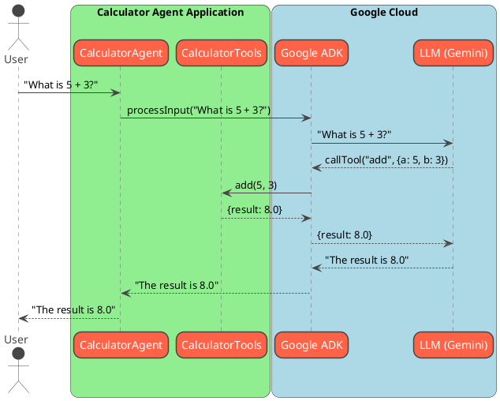

# Architecture

This document provides a detailed overview of the Calculator Agent's architecture, its components, and their interactions.

## System Overview

The Calculator Agent is a Java-based application that uses the Google Agent Development Kit (ADK) to create a conversational AI capable of performing basic arithmetic calculations. The agent leverages a Large Language Model (LLM) to understand user input and execute the appropriate tool.

## Core Components

The system is composed of the following key components:

1.  **`CalculatorAgent`**: The main entry point of the application. It initializes the LLM agent, configures it with the necessary tools, and manages the user interaction loop.

2.  **`CalculatorTools`**: A utility class that contains the actual implementation of the arithmetic operations (add, subtract, multiply, divide). These methods are exposed to the LLM as "tools" that it can call.

3.  **Google ADK**: The underlying framework that provides the core functionality for building the agent. It handles the communication with the LLM, tool execution, and session management.

4.  **LLM (Gemini)**: The language model that processes the user's natural language input, determines the user's intent, and decides which tool to call with which arguments.

## Architecture Diagram

The following diagram illustrates the flow of information between the user, the agent, and the LLM:

## Detailed Flow

1.  **User Input**: The user provides a natural language query to the `CalculatorAgent` (e.g., "What is 5 + 3?").

2.  **Agent Processing**: The `CalculatorAgent` receives the input and passes it to the Google ADK for processing.

3.  **LLM Interaction**: The ADK sends the user's query to the LLM (Gemini). The LLM, guided by its instructions and the available tools, determines that it needs to call the `add` tool with the numbers 5 and 3.

4.  **Tool Execution**: The ADK receives the tool-call request from the LLM and invokes the `add` method in the `CalculatorTools` class.

5.  **Result Handling**: The `CalculatorTools.add` method returns the result (8.0) to the ADK.

6.  **Response Generation**: The ADK sends the tool's result back to the LLM, which then formulates a natural language response (e.g., "The result is 8.0").

7.  **User Output**: The ADK returns the final response to the `CalculatorAgent`, which then displays it to the user.

This architecture effectively separates the natural language understanding (handled by the LLM) from the actual business logic (implemented in `CalculatorTools`), making the system modular and easy to extend.
